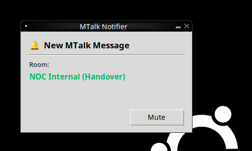

# MTalk Notifier

A lightweight background notifier for Windows 11 that watches a single MTalk
chat room and a single MTalk account, and plays a sound + shows a small popup
whenever a new unread message arrives.

Monitored by default (edit `config.json` to change):

- Room: `NOC Internal (Handover)`
- Account: `GNMC`

Detection uses **Windows UI Automation** (the same OS accessibility API that
screen readers use) so it works without touching MTalk internals, without
screen scraping, and without keyboard/mouse hooks.

## Popup

```
---------------------------------------
🔔 New MTalk Message

Room:
NOC Internal (Handover)

            [ Mute ]
---------------------------------------
```

Preview (rendered on Linux for QA; on Windows 11 the bell renders as a real
emoji thanks to Segoe UI Emoji):



Behaviour of the **Mute** button (also triggered by pressing `Enter`, `Esc`,
or closing the popup):

1. Stops the warning sound immediately.
2. Closes the popup.
3. Marks the current unread state as handled — the notifier will **not**
   re-alert for the same message.
4. The next alert only fires when a genuinely new unread arrives (the unread
   count for the target increases).

## How new-message detection works

1. Find any top-level window whose title matches one of
   `window_title_hints` in `config.json` (defaults: `MTalk`, `mTalk`, `엠톡`).
2. For each configured target, walk the UI Automation tree beneath that
   window and locate an element whose name contains the target text.
3. Extract the target's current *unread count* from the element name and
   its neighbours. Recognised patterns:
   - `NOC Internal (Handover) (3)` — parenthesised suffix
   - `GNMC 5` / `GNMC 99+` — trailing number
   - Neighbour text that is a standalone integer (badge)
   - Neighbour text containing `unread`, `new`, `새`, `안읽`, `미읽`
4. Compare with the previous observation:
   - **Higher than last** → fire one alert, remember the new count.
   - Same or lower → update the counter silently.
   - Element not visible → no change (avoids phantom 0→N transitions).
5. The initial observation on startup is **silent** — the notifier only
   alerts for messages that arrive *after* it starts.

### Event-driven with polling safety net

The notifier prefers UI Automation `StructureChanged` and `PropertyChanged`
(NameProperty) events subscribed on the MTalk window subtree, so alerts
fire almost instantly. It **always** also runs a 1s poll as a safety net so
no message is missed if event delivery lags or drops (per spec:
_"Poll every 1 second if UI Automation Events are unavailable"_).

## Install

Requires Python 3.10+ on Windows 11.

```
py -m venv .venv
.venv\Scripts\activate
pip install -r requirements.txt
```

Drop your warning sound at `sounds/warning.mp3`. If you don't have one
handy, run this once to generate a fallback tone the notifier will use
automatically:

```
python sounds\generate_warning_wav.py
```

## Run

**Silent background (no console window):**

```
run.bat
```

Or the raw command:

```
pythonw run_hidden.pyw
```

**With a visible console (for debugging):**

```
run.bat --console
```

Or:

```
python -m src.main --verbose
```

Logs are written to `logs/mtalk_notifier.log` (rotating, 1 MB × 3 files).
Every detected new message is logged with target name and new unread count.

### Autostart on login (optional)

1. Press `Win + R`, type `shell:startup`, hit Enter.
2. Right-click in the Startup folder → *New → Shortcut*.
3. Target: full path to `run.bat` from this project.

The notifier will then start silently on every login.

## Configuration reference (`config.json`)

| Key | Description |
| --- | --- |
| `targets[]`             | List of targets. Each has `kind` (`room` or `account`), `name` (exact text as shown in MTalk), and optional `display`. |
| `window_title_hints`    | Substrings any of which must appear in the MTalk main window title. |
| `poll_interval_seconds` | Safety-net poll cadence. Defaults to 1s. |
| `sound_file`            | Warning sound. Missing `.mp3` automatically falls back to sibling `.wav`. |
| `log_file`              | Rotating log path. |
| `popup.width/height`    | Popup size in pixels. |
| `popup.always_on_top`   | Whether the popup stays above other windows. |
| `prefer_events`         | Try UI Automation events; falls back to polling on failure. |

## Resource usage

- Idle CPU: near-zero (the detector thread sleeps between events / polls).
- Memory: ~30-40 MB steady state (Python + Tk + pygame mixer).
- No network usage.

## Repo layout

```
config.json                # target rooms / accounts + settings
run.bat / run_hidden.pyw   # background launchers for Windows
requirements.txt
sounds/
  generate_warning_wav.py  # stdlib-only fallback WAV generator
  warning.wav              # produced by the script above
src/
  main.py                  # CLI entry point
  notifier.py              # Tk main-thread coordinator
  detector.py              # UI Automation detector + dedup state machine
  popup.py                 # Alert popup with Mute button
  sound_player.py          # pygame-based player with stop()
  config.py                # AppConfig dataclass + loader
tests/
  test_config.py
  test_detector_helpers.py
  test_detector_state.py
```

## Running the tests

```
python -m unittest discover -s tests -v
```

The tests are pure-Python and don't require Windows or a display — they
drive the detector's state machine and text-extraction logic with a fake
UI Automation tree.
